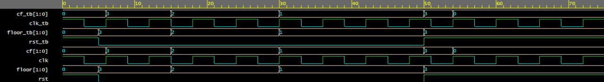

# Lift Control logic implemented using FSM

## **Description**
2 bit finite state machine logic is implemented using System Verilog.

## **Under The Guidance Of**
- [Zeeshan Rafique](https://github.com/zeeshanrafique23)
- [Sajjad Ahmed](https://github.com/sajjadahmed677)

## **Pre-Req Tools**
- EDA Playground [EDAPlayground](https://edaplayground.com/)

## **Waveform Snapshot**

